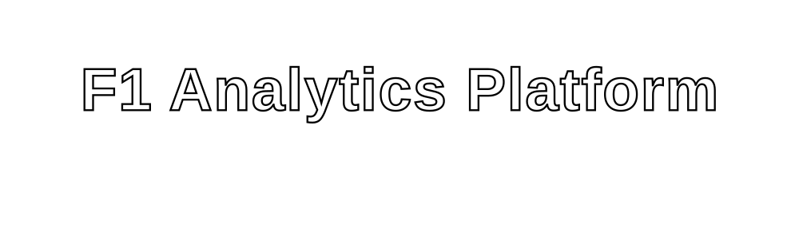

<p align="center">
  
</p>


<br/>

```
 ██████╗  █████╗ ████████╗ █████╗      ██╗███████╗    ██╗   ██╗███╗   ██╗██╗      ██████╗  ██████╗██╗  ██╗███████╗██████╗ 
 ██╔══██╗██╔══██╗╚══██╔══╝██╔══██╗     ██║██╔════╝    ██║   ██║████╗  ██║██║     ██╔═══██╗██╔════╝██║ ██╔╝██╔════╝██╔══██╗
 ██║  ██║███████║   ██║   ███████║     ██║███████╗    ██║   ██║██╔██╗ ██║██║     ██║   ██║██║     █████╔╝ █████╗  ██║  ██║
 ██║  ██║██╔══██║   ██║   ██╔══██║     ██║╚════██║    ██║   ██║██║╚██╗██║██║     ██║   ██║██║     ██╔═██╗ ██╔══╝  ██║  ██║
 ██████╔╝██║  ██║   ██║   ██║  ██║     ██║███████║    ╚██████╔╝██║ ╚████║███████╗╚██████╔╝╚██████╗██║  ██╗███████╗██████╔╝
 ╚═════╝ ╚═╝  ╚═╝   ╚═╝   ╚═╝  ╚═╝     ╚═╝╚══════╝     ╚═════╝ ╚═╝  ╚═══╝╚══════╝ ╚═════╝  ╚═════╝╚═╝  ╚═╝╚══════╝╚═════╝ 
```

</div>

---

<div align="center">


</div>

---

## 🔴 TABLE OF CONTENTS

```
  01 ── The Problem
  02 ── Our Solution
  03 ── Tech Stack  
  04 ── System Architecture
  05 ── Key Features
  06 ── Project Structure
  07 ── Getting Started
  08 ── API Reference
  09 ── Data Pipeline
  10 ── Team NOVA
```

---

## `01` 🏁 THE PROBLEM — F1 STRATEGY IS BRUTALLY COMPLEX

<div align="center">


</div>

Formula 1 is the most data-intensive sport on the planet — over **1.5 terabytes of data** per race weekend. Yet, traditional tooling fails to synthesize this into actionable, real-time strategy intelligence.

### ❌ Challenge 01 — Tire Degradation Is Non-Linear

Wear accelerates unpredictably based on driver style, track temperature, compound choice, and lap history. No two stints are identical — the performance cliff can appear at lap 22 or lap 35. Without predictive modeling, teams are flying blind.

### ❌ Challenge 02 — Pit Window Timing Is High-Stakes

Pit too early and you surrender track position. Pit too late and your tires fall off a cliff. The optimal window can be as **narrow as 2 laps**, decided in under 30 seconds. Manual analysis simply cannot keep up.

### ❌ Challenge 03 — Driver Matchups Lack Objective Data

Head-to-head analysis in real time requires synthesizing cornering speed, tire management, and straight-line performance simultaneously — **impossible with a spreadsheet**. Subjective commentary dominates what should be a data-driven comparison.

---

## `02` ✅ OUR SOLUTION — A Unified F1 Intelligence Platform

> **An end-to-end performance analytics system** that ingests live race data, models tire degradation curves, predicts pit windows, and enables objective driver benchmarking — all in a real-time dashboard.

| Feature | Traditional Tooling | **Our System** |
|---|---|---|
| Tire degradation prediction | ❌ Manual estimation | ✅ ML-powered curve modeling |
| Pit window optimization | ❌ Engineer intuition | ✅ Algorithmic strategy scoring |
| Driver benchmarking | ❌ Lap-time averages only | ✅ Multi-dimensional telemetry analysis |
| Data latency | ❌ Post-race only | ✅ Near real-time updates |
| Accessibility | ❌ Internal tools only | ✅ Web-based public dashboard |

---

## `03` ⚙️ TECH STACK

<div align="center">

| Layer | Technology | Purpose |
|---|---|---|
| 🖥️ **Frontend** | `Next.js 14` + `TypeScript` | SSR dashboard & UI |
| 🎨 **Styling** | `Tailwind CSS` | Responsive Audi-themed design |
| 🐍 **Backend** | `Python` + `FastAPI` (`app.py`) | Data processing & REST API |
| 📦 **Components** | `components.json` (shadcn/ui) | Modular UI component library |
| 🔄 **State/Hooks** | Custom React `hooks/` | Data fetching & race state |
| 📊 **Data Layer** | `lib/` utilities | F1 data transformation & logic |
| 🌐 **Deployment** | `Vercel` + `Python Cloud` | Frontend + backend hosting |
| 📡 **Data Source** | `FastF1` / Ergast F1 API | Official F1 telemetry data |

</div>

### Tech Highlights

```python
# Backend: app.py - FastAPI serving F1 telemetry endpoints
from fastapi import FastAPI
from fastapi.middleware.cors import CORSMiddleware
import fastf1

app = FastAPI(title="F1 Performance Tracker API")

@app.get("/api/tire-degradation/{race}/{driver}")
async def get_tire_degradation(race: str, driver: str):
    """Returns lap-by-lap compound performance data."""
    ...

@app.get("/api/pit-window/{race}/{driver}")
async def get_pit_window(race: str, driver: str):
    """Returns optimal pit window prediction."""
    ...
```

```typescript
// Frontend: hooks/useTireData.ts — Custom React Hook
export function useTireData(race: string, driver: string) {
  const [degradation, setDegradation] = useState<TireData[]>([]);
  // Fetches and streams live tire degradation data
  ...
}
```

---

## `04` 🏗️ SYSTEM ARCHITECTURE

```
┌─────────────────────────────────────────────────────────────┐
│                    F1 INTELLIGENCE PLATFORM                 │
│                   ━━━━━━━━━━━━━━━━━━━━━━━                   │
│                                                             │
│   ┌──────────────┐    ┌──────────────┐    ┌─────────────┐  │
│   │  FastF1 API  │───▶│  Python      │───▶│  Next.js    │  │
│   │  Ergast API  │    │  Backend     │    │  Dashboard  │  │
│   │  (Live Data) │    │  (app.py)    │    │  (Frontend) │  │
│   └──────────────┘    └──────────────┘    └─────────────┘  │
│                              │                    │         │
│                    ┌─────────▼──────┐   ┌─────────▼──────┐ │
│                    │  Tire Model    │   │  Telemetry     │ │
│                    │  Degradation   │   │  Charts &      │ │
│                    │  Predictor     │   │  Driver HUD    │ │
│                    └────────────────┘   └────────────────┘ │
│                                                             │
└─────────────────────────────────────────────────────────────┘

  DATA FLOW:
  Race Telemetry ──▶ FastAPI Processing ──▶ REST Endpoints
       ──▶ React Hooks ──▶ UI Components ──▶ Live Dashboard
```

---

## `05` 🚀 KEY FEATURES

<div align="center">


</div>

### 🔴 01 — Real-Time Tire Degradation Tracker
- Lap-by-lap compound performance modeling (Soft / Medium / Hard)
- Non-linear degradation curves with cliff-point prediction
- Driver-specific wear fingerprinting based on historical stints

### ⚪ 02 — Pit Stop Strategy Optimizer
- Algorithmic pit window scoring across all compounds
- Undercut/overcut scenario simulation
- Track position vs. tire age tradeoff visualization

### 🔴 03 — Driver Head-to-Head Benchmarking
- Sector-by-sector time delta comparison
- Telemetry overlays: throttle, brake, speed traces
- Traction zone and corner speed analysis

### ⚪ 04 — Race Pace Intelligence
- Rolling lap time averages filtered by fuel load and safety car periods
- Gap evolution charts (position vs. time)
- Championship points scenario modeling

---

## `06` 📁 PROJECT STRUCTURE

```
anshxgaur/F1/
│
├── 📂 app/                     # Next.js App Router (pages & layouts)
│   ├── page.tsx                # Main dashboard entry
│   ├── layout.tsx              # Root layout with Audi theme
│   └── api/                    # Next.js API routes
│
├── 📂 components/              # Reusable React UI components
│   ├── TireDegradationChart/   # Lap-by-lap compound performance
│   ├── PitWindowOptimizer/     # Strategy recommendation panel
│   ├── DriverComparison/       # Head-to-head telemetry overlay
│   └── RacePaceBoard/          # Live pace intelligence
│
├── 📂 hooks/                   # Custom React hooks
│   ├── useTireData.ts          # Tire degradation data fetching
│   ├── useDriverStats.ts       # Driver telemetry hook
│   └── useRaceSession.ts       # Live session state management
│
├── 📂 lib/                     # Shared utilities & data logic
│   ├── f1DataTransform.ts      # Raw API → chart-ready data
│   ├── tireDegradation.ts      # Degradation curve algorithms
│   └── constants.ts            # Team colors, compound colors
│
├── 📂 styles/                  # Global styles & Audi theme
│   └── globals.css             # Tailwind base + custom vars
│
├── 📂 public/                  # Static assets
│
├── 🐍 app.py                   # FastAPI Python backend
├── ⚙️  next.config.mjs          # Next.js configuration
├── 📋 components.json          # shadcn/ui registry config
├── 📦 package.json             # Node dependencies
└── 🔒 pnpm-lock.yaml           # Locked dependency tree
```

---

## `07` 🛠️ GETTING STARTED

### Prerequisites

```bash
node >= 18.0.0
python >= 3.10
pnpm >= 8.0.0
```

### 🔴 Frontend Setup

```bash
# Clone the repository
git clone https://github.com/anshxgaur/F1.git
cd F1

# Install dependencies using pnpm
pnpm install

# Set up environment variables
cp .env.example .env.local
# Add your API keys to .env.local

# Start the development server
pnpm dev
```

Open [http://localhost:3000](http://localhost:3000) to view the dashboard.

### ⚪ Backend Setup (Python / FastAPI)

```bash
# Create a virtual environment
python -m venv venv
source venv/bin/activate  # Windows: venv\Scripts\activate

# Install Python dependencies
pip install -r requirements.txt

# Run the FastAPI server
uvicorn app:app --reload --port 8000
```

API docs auto-generated at [http://localhost:8000/docs](http://localhost:8000/docs)

### Environment Variables

```env
# .env.local
NEXT_PUBLIC_API_URL=http://localhost:8000
ERGAST_API_BASE=https://ergast.com/api/f1
FASTF1_CACHE_DIR=./cache
```

---

## `08` 📡 API REFERENCE

| Method | Endpoint | Description |
|---|---|---|
| `GET` | `/api/races/{year}` | All races in a season |
| `GET` | `/api/tire-degradation/{race}/{driver}` | Compound lap data |
| `GET` | `/api/pit-window/{race}/{driver}` | Optimal pit prediction |
| `GET` | `/api/driver-compare/{race}/{d1}/{d2}` | Head-to-head telemetry |
| `GET` | `/api/race-pace/{race}` | Full-field pace analysis |
| `GET` | `/api/standings/{year}` | Championship standings |

#### Example Response — Tire Degradation

```json
{
  "driver": "VER",
  "race": "Bahrain_2024",
  "stints": [
    {
      "compound": "MEDIUM",
      "lap_start": 1,
      "lap_end": 18,
      "avg_degradation_per_lap": 0.043,
      "cliff_predicted_lap": 21,
      "lap_times": [90.123, 90.287, 90.455, ...]
    }
  ]
}
```

---

## `09` 🔁 DATA PIPELINE

```
  ┌──────────────┐     ┌────────────────┐     ┌──────────────────┐
  │  FastF1 /    │     │  Python Data   │     │  Processed JSON  │
  │  Ergast API  │────▶│  Transformer   │────▶│  via REST API    │
  │  (raw laps)  │     │  (app.py)      │     │  /api/...        │
  └──────────────┘     └────────────────┘     └──────────────────┘
                                                       │
                              ┌────────────────────────┘
                              ▼
                    ┌──────────────────┐
                    │  React Hooks     │
                    │  (useTireData,   │
                    │  useDriverStats) │
                    └──────────────────┘
                              │
                    ┌─────────▼──────────┐
                    │  Next.js Dashboard │
                    │  Components (UI)   │
                    └────────────────────┘
```

**Data Sources Used:**
- 📡 **FastF1** — Official F1 telemetry (lap times, tire data, sector splits)
- 🏎️ **Ergast API** — Historical race data & championship standings
- 🔧 **Custom scraping layer** — Pit stop timing data enrichment

---

## `10` 👥 TEAM NOVA

<div align="center">


<br/>

| | Member | Role |
|---|---|---|
| 🔴 | **Ansh Gaur** | Full-Stack Lead & Architecture |
| ⚪ | **Aarush Srivastava** | Backend & Data Engineering |
| 🔴 | **Ananya Gupta** | Frontend & UI/UX |
| ⚪ | **Ankit Shukla** | ML Modeling & Analytics |

<br/>

*Focus Areas: AI/ML Engineering · Full-Stack Development · Competitive Programming*

<br/>

[](https://github.com/100axe001)

</div>

---

## 📜 BUILT FOR

<div align="center">

```
  ████████╗██████╗  █████╗  ██████╗██╗  ██╗    ███████╗ ██╗
  ╚══██╔══╝██╔══██╗██╔══██╗██╔════╝██║ ██╔╝    ██╔════╝███║
     ██║   ██████╔╝███████║██║     █████╔╝     █████╗  ╚██║
     ██║   ██╔══██╗██╔══██║██║     ██╔═██╗     ██╔══╝   ██║
     ██║   ██║  ██║██║  ██║╚██████╗██║  ██╗    ██║      ██║
     ╚═╝   ╚═╝  ╚═╝╚═╝  ╚═╝ ╚═════╝╚═╝  ╚═╝   ╚═╝      ╚═╝
```

**Formula 1 Track — Special Category**

*"Build solutions inspired directly by Formula 1 and motorsports technology."*

**Projects built in this track will receive special priority.**

</div>

---

<div align="center">


<br/>

**⬛🔴⬛ TEAM NOVA · F1 PERFORMANCE TRACKING SYSTEM · TRACK 01 · SPECIAL CATEGORY ⬛🔴⬛**

<br/>

*Made with ❤️ and a lot of lap data*

</div>
